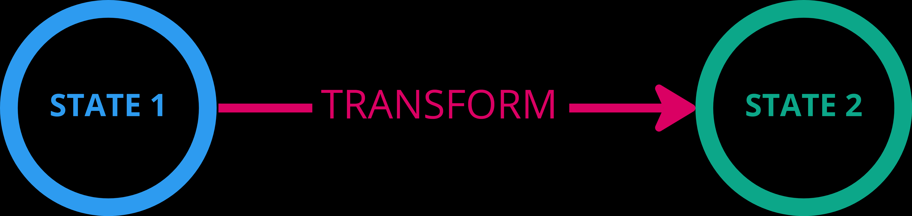
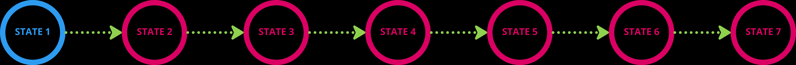

# Primer on Configuration Management

Every computer system requires to manage its configuration, one way or another, but there are a few noticeable
concepts that are worth expanding upon when addressing scalability.  

The first one is the when we don't _manage_ the changes, we usually update the configuration through
a GUI or an API, rely on what we know of the system, and estinguish the fires as needed.  
For a small team with a small system to manage, and fairly stable needs, that might just work.  
Afterall that was one of the selling points for Windows servers when only a handful of those servers were needed
for the IT needs of an organisation.

The Unixes (and derived flavours) had managed some level of scale through task automation, using scripting, and 
leveraging the powerful shell and utilities built over the years. But even this approach showed its limit
when many members had to collaborate on a great number of systems. 

As the digital age was conquering more services and industry, the IT services tried to find new ways to
scale. The number of servers needed grew exponentially, the number of team members increased, the
requirements where in perpetual evolution, and the complexity of the systems skyrocketed.  

While the manual configuration of systems remained for small scale deployments, bigger players had to 
contend with the problem. At that time, from the late 90s to the 2000s, a few trends emerged.

One approach was to build software dedicated to manage systems, with the same old approach, but aimed to scale.
The usual design revolves around a CMDB, coupled with some monitoring, a central GUI to make the changes,
and pushing changes from the central server as they're released. 

The other approach started from the principle that managing through GUI was hard to scale, hard to reproduce
reliably, hard to document, or simply put, to collaborate.  
There was an opportunity to leverage the learnings of 30 years of collaborative practices from software engineering.
All that was needed was to find a way to manage the **infrastructure from code**.  
This is the part I'm interested in covering today.

This article explains the concepts behind configuration management from code (policy-driven configuration),
the natural evolution from (imperative) scripting, and its characteristics.  
In this context, Configuration Management (CM) refers to the practices that crystallized with CFEngine,
and later evolved with Puppet (2005), OpsCode later Chef software (2008), Desired State Configuration
(2012), and more recently Kubernetes (2014) with its object system (although it has its own specificities).

Many other Configuration Management tools exist and are not mentioned above. Either they don't use the same
principle (i.e. GUI-driven), or they may follow, enable or implement similar approaches (sometimes partially).
The concepts described here may sound applicable to those other tools, but their interpretation by the tool
might differ enough that it's risky to accept them in the same category and when used may risk its user
to suffer from the scaling problems Configuration Management attempts to address.

## Problem definition

Setting up a system usually starts from a base configuration, sometimes seen as the default configuration or
the **current state** of the configuration. We start from that state, and progressively change it to the
state we want: the **Desired State**.  

In this sections we'll define the problem and introduce some generic terms that help discuss the problem.

### Changes by transformative actions

Each change transforms the system into a new state.  
Reverting a change is applying a new transformative action, effectively creating a new state.  
In configuration management, believing in rollbacks of configuration is a fallacy. The closest we can get to a
rollback is when restoring a snapshot of a system (with all the caveats for the technology and the environment).

### Configuration: A Directed Acyclic Graph

For this reason, the configuration of a system can be seen as a Directed Acyclic Graph, where each transformation
(i.e. change to the system) is a vertex (arrow), and each resulting state an edge (or node).

It is also sometimes useful to take into consideration that the state evolves over time, that's why I prefer to
represent the DAG horizontally.  
The more time the system is alive, the more time it has to be subject to change, hence the bigger potential for
complexity.  
Limiting the time the system is alive, reduce drastically its potential for complexity.

Imagine attempting to trace the graph of an Active Directory domain that has existed for more than 20 years...

## Scaling and dealing with complexity

Complexity can be very subjective, but it's usually easier to discuss on what makes a system more complex
to manage.  
I usually use 3 factors to describe complexity:
- Number of elements to manage (number of nodes, services, systems...)
- Number of changes going into the system (something that changes once every year compared to every minutes)
- Number of people working on the changes (how many people are making changes to the system)

If all of them are low, the complexity should be manageable.
If one starts increasing drastically, it will proportionally affect complexity.
If several factors are involved, complexity will evolve exponentially.

Time, again, as an aggravating factor on all of them:
- some tech becomes old and less-known or less practical to manage
- old changes are forgotten and the longer a system is alive the more changes it potentially had
- People come and go in the team, eroding the institutional knowledge of the systems

## Managing Complexity with abstraction

To change a system, we (or the GUI) execute some code.
This code is written in explicit sequence of commands that describe **how** the system
should do the changes.  

Those are **imperative commands**, or imperative code.

It may take a great number of low-level changes to configure a system, so to simplify the management
of the changes, we abstract low level changes into higher level ones.  
One of the benefit is to enable a person less skilled in the low-level management of the system, to make changes that 
they understand they need at a high level.

Typically, we group low level commands/calls into higher level
functions, so that the following changes:  

Can be understood like so:

These functions are still imperative transforms, and only apply a (set of) change(s),
**and may fail to do so, even partially**.  

This is why we write scripts, and sometimes we also add some "business logic" or specifics.

Changing a system to a desired state with imperative
transforms requires a rather **complex sequence**
(do _a_ then _b_) and **logic** (if, then) to ensure the transforms
towards the desired state succeed.

There is no guarantee that we will reach the desired state
(beyond what's written within the script),
and that the prerequisities are met before we can apply those
changes (again, except what's within the script).
Once an imperative transform has been applied, we don't know
what happens if we try to apply the same transform again.  
The point here is that a good script won't have those problems,
but it's not safe to make any assumptions.

### Imperative transforms do not scale well

While abstracting with higher level function helps, it does not scale
well when managing complex systems managed by several people, and constantly
changing over time.

Even with higher level functions, we focus on the transformation they bring, and the
parameters they need for a given transformation.  

By thinking about the transforms, we force the administrators to think in terms
of changes at a given time, but they lose the ability to understand the bigger picture.

We're making the configuration transactional, and the administrator focuses
on a single transaction at a given time.

### Configuration Drift

Traditionally, we then rely on monitoring to get an idea of the current 
state of that system. By doing so, we tend to consider the compliance with the 
desired state only after all the transforms have been applied.  
It is also often the case where we will create that monitoring, and eventually
write the documentation about that state (first corner to be cut when
constrained by time), after the transforms have been applied.

When the system to configure is complex, we have to chain those imperative
transforms together (run script 1, then script 2), maybe over a long time or
across different people or teams, increasing change management complexity.  
As time passes, it's easy for the system to change away from that state
we wanted, without being caught by monitoring and remediated. This is called
**configuration drift**, and often accumulates over time.

### Elevating abstractions with **idempotent** resources

To improve the abstraction offered by standalone scripts or higher level
commands, we can ask those scripts to follow some conventions, fulfill a **contract**.  
The first is to make sure we only apply a change when needed,
which means we test if the change is needed before we apply the transform.  

By doing so, we expect that no matter how many times you apply the transform,
it will only change the system when needed, and always gives the same result.  

This is **idempotence**, and it is implemented with the following approach.

For a **configuration item** (unit of configuration properties in a scoped domain),
we **declare** the values desired, the state.
The _resource_ has to **converge** to that state, and to do so, the resource
implements the following methods:
- **Test**: Find out whether the current state is the same as the desired state.
- **Set**: Apply the Transform to converge to the desired state.

The test has to find out the current state, in a way or another.  
The best practice is to call a third method:
- **Get**: Retrieve the current state (so that it can be compared with the desired state).

In practice, that changes how the transform is thought from:  
`Append the content '[something]' to the end of the file xyz.txt.`  
We now change the thinking to:  
`Make sure the file xyz.txt ends with '[something]'.`

The difference is that we want the file to end with that content, not to bluntly
add the content if it's already there.  
The focus has now shifted to the states we want to reach, not so much about what
imperatives changes are required to get there.

While *the resource* that effects the change is still some kind of "high level function",
script, or code, we now have a more scalable abstraction which weighs less on the
the cognitive load. We can think, discuss, collaborate in state (which is just data),
and we don't have to handle the logic (if/else) at this level of discussion.  
It is also easier to extract information about the current state, calling the **Get**
method of the resources we discussed.

### Composing a desired state

